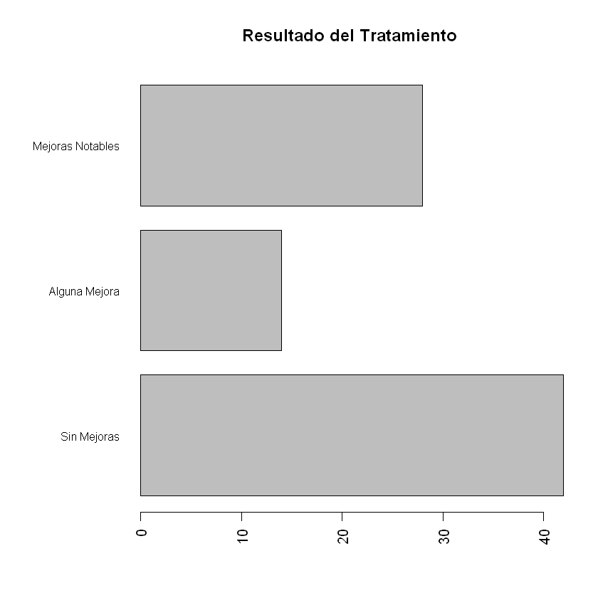
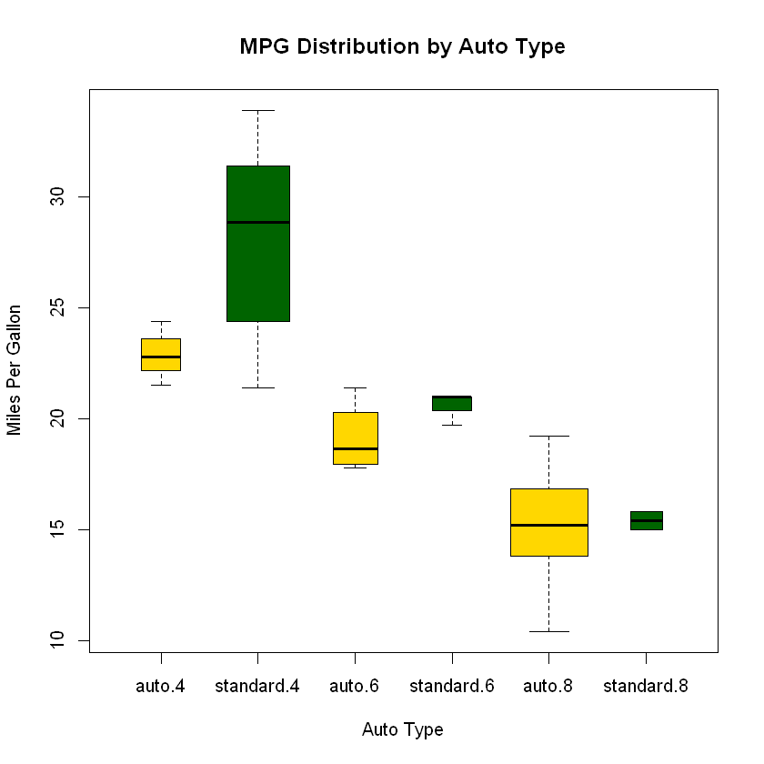

# Métodos Básicos

## Gráficas Básicas

### Diagramas de Barras


```
library(vcd)
head(Arthritis)
```

    Loading required package: grid
    


<table>
<thead><tr><th scope=col>ID</th><th scope=col>Treatment</th><th scope=col>Sex</th><th scope=col>Age</th><th scope=col>Improved</th></tr></thead>
<tbody>
	<tr><td>57     </td><td>Treated</td><td>Male   </td><td>27     </td><td>Some   </td></tr>
	<tr><td>46     </td><td>Treated</td><td>Male   </td><td>29     </td><td>None   </td></tr>
	<tr><td>77     </td><td>Treated</td><td>Male   </td><td>30     </td><td>None   </td></tr>
	<tr><td>17     </td><td>Treated</td><td>Male   </td><td>32     </td><td>Marked </td></tr>
	<tr><td>36     </td><td>Treated</td><td>Male   </td><td>46     </td><td>Marked </td></tr>
	<tr><td>23     </td><td>Treated</td><td>Male   </td><td>58     </td><td>Marked </td></tr>
</tbody>
</table>


```R
counts <- table(Arthritis$Improved); counts
```


    
      None   Some Marked 
        42     14     28 


#### Barras simples:
Se usa la linea ```barplot(altura)``` donde ```"altura"``` es el vector o matriz que se va a graficar


```R
barplot(counts,
        main="Simple Bar Plot",
        xlab="Improvement", ylab="Frequency")
```


#### Barras Horizontales


```R
barplot(counts,
        main="Horizontal Bar Plot",
        xlab="Frequency", ylab="Improvement",
        horiz=TRUE)
```


#### Usar sólo los factores


```R
par(mfrow=c(1,2))
plot(Arthritis$Improved, main="Simple Bar Plot",
     xlab="Improved", ylab="Frequency")
plot(Arthritis$Improved, horiz=TRUE, main="Horizontal Bar Plot",
     xlab="Frequency", ylab="Improved")
par(mfrow=c(1,1))
```


#### Barras Agrupadas y Apiladas


```R
counts <- table(Arthritis$Improved, Arthritis$Treatment)
counts
```


            
             Placebo Treated
      None        29      13
      Some         7       7
      Marked       7      21


```R
par(mfrow=c(1,2))
barplot(counts,
        main="Barras Apiladas",
        xlab="Treatment", ylab="Frequency",
        col=c("red", "yellow","green"),
        legend=rownames(counts))

barplot(counts,
        main="Barras Agrupadas",
        xlab="Treatment", ylab="Frequency",
        col=c("red", "yellow", "green"),
        legend=rownames(counts), beside=TRUE)
par(mfrow=c(1,1))
```


#### Barras de Medias (o cualquier medida)


```R
states <- data.frame(state.region, state.x77)
means <- aggregate(states$Illiteracy, by=list(state.region), FUN=mean)
means
```


<table>
<thead><tr><th scope=col>Group.1</th><th scope=col>x</th></tr></thead>
<tbody>
	<tr><td>Northeast    </td><td>1.000000     </td></tr>
	<tr><td>South        </td><td>1.737500     </td></tr>
	<tr><td>North Central</td><td>0.700000     </td></tr>
	<tr><td>West         </td><td>1.023077     </td></tr>
</tbody>
</table>


```R
means <- means[order(means$x),]
means
```


<table>
<thead><tr><th></th><th scope=col>Group.1</th><th scope=col>x</th></tr></thead>
<tbody>
	<tr><th scope=row>3</th><td>North Central</td><td>0.700000     </td></tr>
	<tr><th scope=row>1</th><td>Northeast    </td><td>1.000000     </td></tr>
	<tr><th scope=row>4</th><td>West         </td><td>1.023077     </td></tr>
	<tr><th scope=row>2</th><td>South        </td><td>1.737500     </td></tr>
</tbody>
</table>


```R
barplot(means$x, names.arg=means$Group.1)
title("Tasa Media de Analfabetismo")
```


#### Afinando las Barras


```R
par(mar=c(5,8,4,2))
par(las=2)
counts <- table(Arthritis$Improved)
barplot(counts,
        main="Resultado del Tratamiento",
        horiz=TRUE,
        cex.names=0.8,
        names.arg=c("Sin Mejoras", "Alguna Mejora",
                    "Mejoras Notables"))
```





#### Spinogramas


```R
attach(Arthritis)
counts <- table(Treatment, Improved)
spine(counts, main="Ejemplo de Spinograma")
detach(Arthritis)
```


#### Tortas
Se usa la línea ```pie(x, etiquetas)``` donde ```x``` es el vector de valores y ```etiquetas``` el vector de nombres de las categorías


```R
par(mfrow=c(2, 2))
slices <- c(10, 12,4, 16, 8)
lbls <- c("US", "UK", "Australia", "Germany", "France")
pie(slices, labels = lbls,
    main="Torta Simple")
pct <- round(slices/sum(slices)*100)
lbls2 <- paste(lbls, " ", pct, "%", sep="")
pie(slices, labels=lbls2, col=rainbow(length(lbls2)),
    main="Torta con Porcentajes")

library(plotrix)
pie3D(slices, labels=lbls,explode=0.1,
      main="Torta en 3D")

mytable <- table(state.region)
lbls3 <- paste(names(mytable), "\n", mytable, sep="")
pie(mytable, labels = lbls3,
    main="Torta desde Tabla\n (con tamaños de la muestra)")
par(mfrow=c(1,1))
```


#### Histogramas


```R
par(mfrow=c(2,2))
hist(mtcars$mpg)

hist(mtcars$mpg,
     breaks=12,
     col="red",
     xlab="Miles Per Gallon",
     main="Colored histogram with 12 bins")

hist(mtcars$mpg,
     freq=FALSE,
     breaks=12,
     col="red",
     xlab="Miles Per Gallon",
     main="Histogram, rug plot, density curve")
rug(jitter(mtcars$mpg))
lines(density(mtcars$mpg), col="blue", lwd=2)

x <- mtcars$mpg
h<-hist(x,
        breaks=12,
        col="red",
        xlab="Miles Per Gallon",
        main="Histogram with normal curve and box")
xfit<-seq(min(x), max(x), length=40)
yfit<-dnorm(xfit, mean=mean(x), sd=sd(x))
yfit <- yfit*diff(h$mids[1:2])*length(x)
lines(xfit, yfit, col="blue", lwd=2)
box()
par(mfrow=c(1,1))
```


#### Gráficas de Densidad:


```R
par(mfrow=c(2,1))
d <- density(mtcars$mpg)
plot(d)

d <- density(mtcars$mpg)
plot(d, main="Kernel Density of Miles Per Gallon")
polygon(d, col="red", border="blue")
rug(mtcars$mpg, col="brown")
par(mfrow=c(1,1))
```


```R
library(sm)
attach(mtcars)
cyl.f <- factor(cyl, levels= c(4,6,8),
                labels = c("4 cylinder", "6 cylinder",
                           "8 cylinder"))
sm.density.compare(mpg, cyl, xlab="Miles Per Gallon")
title(main="MPG Distribution by Car Cylinders")
colfill<-c(2:(1+length(levels(cyl.f))))
legend(locator(1), levels(cyl.f), fill=colfill)
detach(mtcars)
```

    Package 'sm', version 2.2-5.4: type help(sm) for summary information
    


    Error in legend(locator(1), levels(cyl.f), fill = colfill): invalid coordinate lengths
    Traceback:
    

    1. legend(locator(1), levels(cyl.f), fill = colfill)

    2. stop("invalid coordinate lengths")


#### Boxplot o Diagrama de Cajas


```R
par(mfrow=c(1,3))
boxplot(mtcars$mpg, main="Box plot", ylab="Miles per Gallon")

boxplot(mpg ~ cyl, data=mtcars,
        main="Car Mileage Data",
        xlab="Number of Cylinders",
        ylab="Miles Per Gallon")

boxplot(mpg ~ cyl, data=mtcars,
        notch=TRUE,
        varwidth=TRUE,
        col="red",
        main="Car Mileage Data",
        xlab="Number of Cylinders",
        ylab="Miles Per Gallon")
```

    Warning message in bxp(structure(list(stats = structure(c(21.4, 22.8, 26, 30.4, :
    "some notches went outside hinges ('box'): maybe set notch=FALSE"


##### Para cruzar factores


```R
mtcars$cyl.f <- factor(mtcars$cyl,
                       levels=c(4,6,8),
                       labels=c("4","6","8"))
mtcars$am.f <- factor(mtcars$am,
                      levels=c(0,1),
                      labels=c("auto", "standard"))
boxplot(mpg ~ am.f *cyl.f,
        data=mtcars,
        varwidth=TRUE,
        col=c("gold","darkgreen"),
        main="MPG Distribution by Auto Type",
        xlab="Auto Type", ylab="Miles Per Gallon")
```





#### Gráficas de Violín


```R
library(vioplot)
x1 <- mtcars$mpg[mtcars$cyl==4]
x2 <- mtcars$mpg[mtcars$cyl==6]
x3 <- mtcars$mpg[mtcars$cyl==8]
vioplot(x1, x2, x3,
        names=c("4 cyl", "6 cyl", "8 cyl"),
        col="gold")
```


#### Diagrama de Puntos


```R
dotchart(mtcars$mpg, labels=row.names(mtcars), cex=.7,
         main="Gas Mileage for Car Models",
         xlab="Miles Per Gallon")
```


Se puede organizar mejor la gráfica


```R
x <- mtcars[order(mtcars$mpg),]
x$cyl <- factor(x$cyl)
x$color[x$cyl==4] <- "red"
x$color[x$cyl==6] <- "blue"
x$color[x$cyl==8] <- "darkgreen"
dotchart(x$mpg,
         labels = row.names(x),
         cex=.7,
         groups = x$cyl,
         gcolor = "black",
         color = x$color,
         pch=19,
         main = "Gas Mileage for Car Models\ngrouped by cylinder",
         xlab = "Miles Per Gallon")
```


